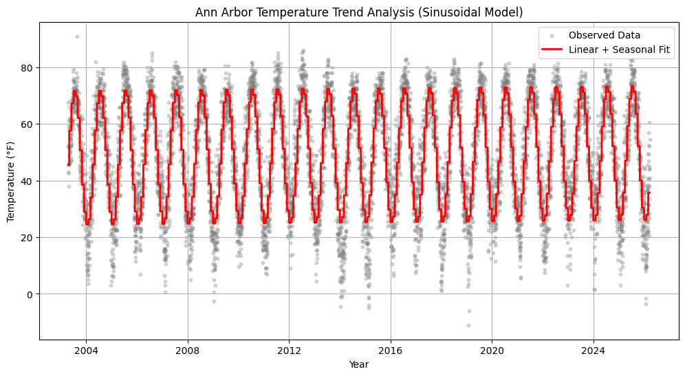

# Ann Arbor Weather Trend Analysis

This project analyzes long-term weather trends in Ann Arbor using Python, least squares regression, and seasonal harmonic modeling.

## Sample Visualization



## Project Overview

The goal of this project is to explore long-term temperature trends in Ann Arbor and identify possible seasonal or long-term patterns. Historical weather data are used to model average daily temperature over time. The analysis combines linear trend modeling with sinusoidal seasonal components to capture both long-term changes and cyclical seasonal variation.

## Statistical Methods

This project applies least squares regression to model temperature trends. The main model uses a linear time trend with sine and cosine terms to represent seasonal variation:

```text
$T = β₀ + β₁t + β₂sin(2πm/12) + β₃cos(2πm/12) + ε$
```

where `t` represents time, `m` represents the month of the year, and the sine and cosine terms capture annual seasonal cycles.

The least squares problem is solved using QR decomposition, which provides a numerically stable way to estimate regression coefficients.


## Main Features

- Long-term weather trend analysis
- Seasonal temperature modeling using sinusoidal functions
- Regression-based climate trend fitting
- QR decomposition for least squares solving
- Time-series visualization and exploratory analysis


## Project Structure

```text
ann-arbor-weather-trend/
├── data/
│   └── data.csv
├── docs/
│   ├── 1_project_proposal.pdf
│   ├── 2_mathematical_theory.pdf
│   └── 3_presentation.pdf
├── figures/
│   └── linear_model.png
│   └── sinusoidal_model.png
├── src/
│   └── analysis.py
└── README.md
```

## Tools Used

- Python
- pandas
- numpy
- matplotlib
- scipy


## Files

- `data/`: Weather dataset used for the analysis
- `docs/`: Project proposal and final presentation
- `src/`: Python scripts for data processing, modeling, and visualization
- `figures/`: Generated plots and model visualizations


## How to Run

Install the required Python packages:

```bash
pip install -r requirements.txt
```

Then run the main analysis script:

```bash
python src/analysis.py
```


## Data Source

Weather data are retrieved from NOAA climate records and stored in `data/data.csv`.


## Author

© 2026 Qihang Cheng. 

This work is licensed under a Creative Commons Attribution-NonCommercial-ShareAlike 4.0 International License.
